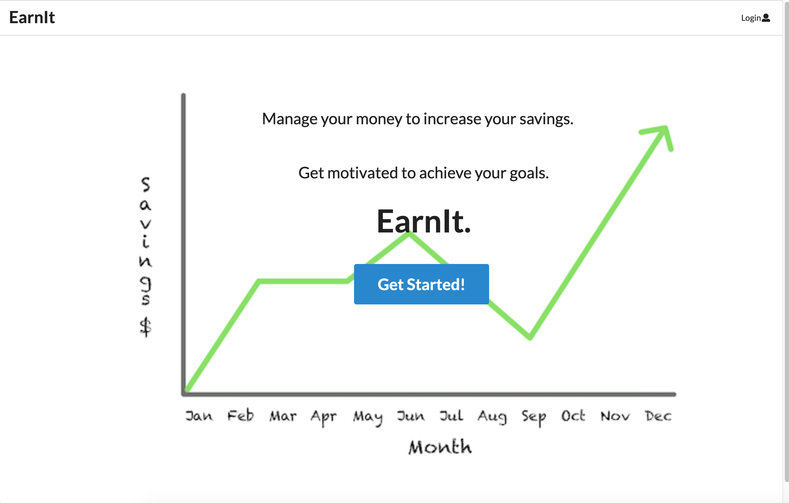
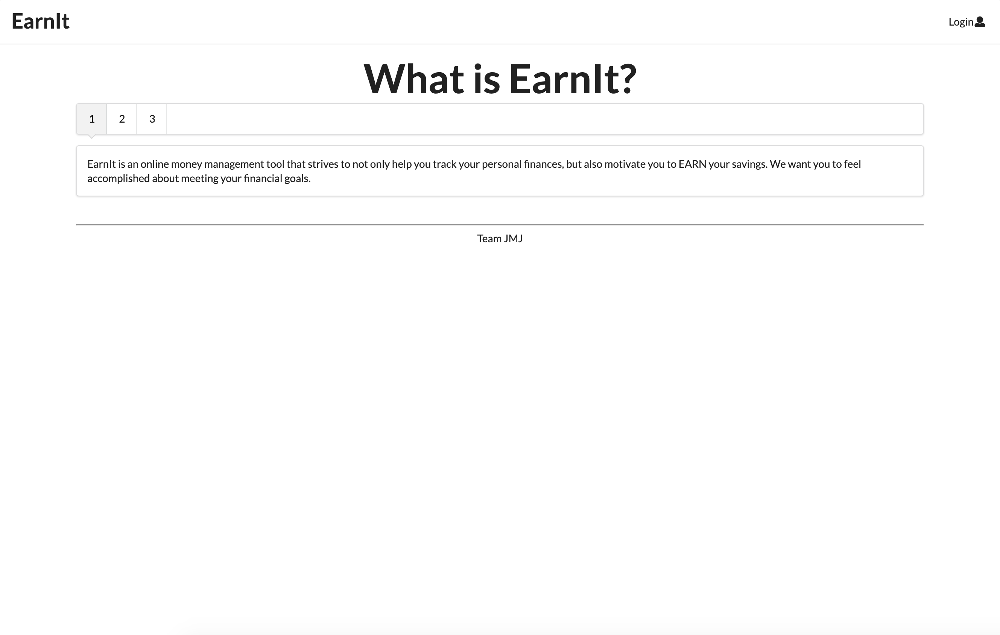
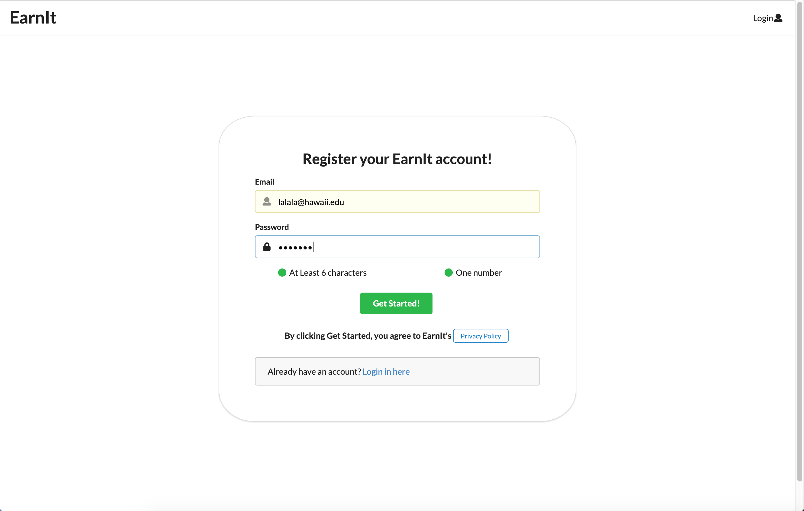
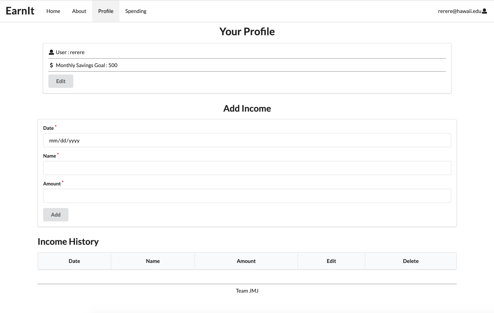
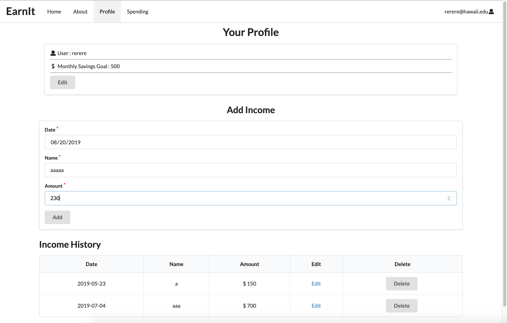
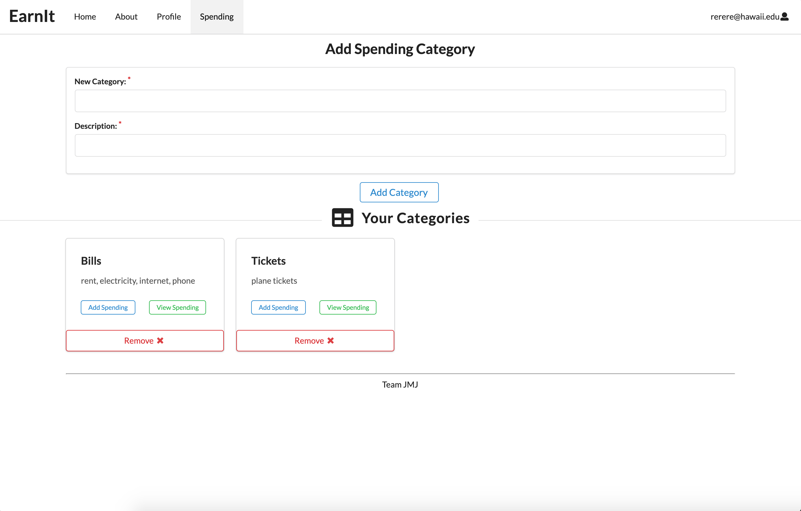
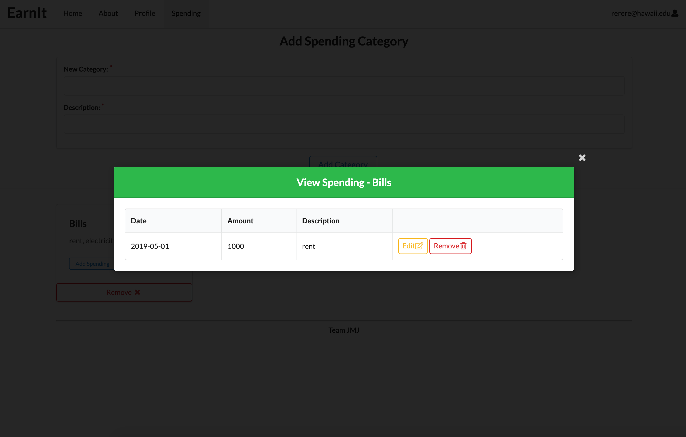
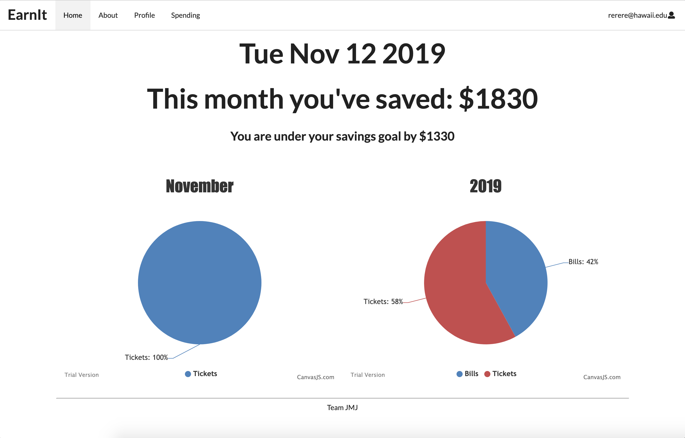

 

  
 
   

 

<h1>Description</h1>

EarnIt is a web application developed for a group project in ICS 491 Security Development class. 
The app was developed using basic HTML and CSS, Javascript Meteor framework, Semantic UI, React library, and IntelliJ Idea. 
The purpose of this project was to learn how to develop an application following Microsoft's Security Development Life Cycle (SDLC). 
The app allows users to keep track of their monthly income and expenses, and set a goal of how much they want to save each month. 
The app requires users to login, create a profile, enter income and expense, and set a goal for saving amount in order to view the current status of how close the user is to saving the set amount. 
The status can be viewed as a graph in the user home page.

 

First, a user logs in or signs up with an email address and a password. 

 

The user can then enter a profile information such as the savings goal.
The user can enter an income in the income page and view the income history in the table shown right below.

 

In the Spending page, the user can create categories of expenses and enter the specific expense within each category.
The history of expense can be viewed in the expense table. 

 

 
The user home page shows the pie graph for each income and expense for the current month, and the user can view how much more they need to save in the current month in order to achieve the savings goal.

 

<h1>Learning Outcomes</h1>

My role in this project was to :
	<li> Design and Implement a Landing page </li>
	<li> Design and Implement a Profile page </li>
	<li> Implement Add Income feature and Income History table in the Profile page </li>

This was the first project we had to think carefully about the security aspect of the app from the beginning to the end. 
We practiced following the SDLC, where we set requirements for the app, design the app features according to the requirements, implement the app, and perform security testing. 
The hardest part of the project was that we could not just implement to make things work. 
Making things work was not enough because we needed to think about wheather the code is secure or not throughout the project.
I learned that in order to develop a secure application, careful planning is the key. 
It is often the case to rush and implement without thinking about the consequence of having to fix a bug later after the product release, but careful planning and implementation can reduce the burden later on. 
Though the app is not perfect, I feel that going through the process of SDLC helped me understand how software development is done in practice.

