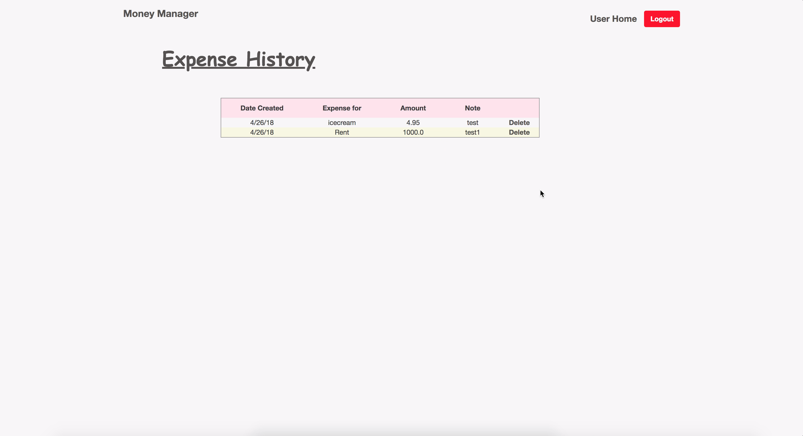

 

  
 

<h1>Description</h1>

Money Manager is a database backed web application developed for a project assigned in ICS 321 Database Systems I class. 
The app was developed using basic HTML and CSS, Java Server Faces framework, Oracle SQL, and Netbeans IDE. 
The application allows users to create an account, input data of the user's income and outcome, and set a goal to save the money for. 
In the main page, the goal set by the user is shown, as well as the remaining amount the user needs to save in order to achieve the goal. 
The message changes to tell the user achieved the goal when the income exceeds the expense and cost of the goal.

 

First, a user logs in or signs up with an email address and a password.

 

The user creates a profile.

 

The user will then enter the description of a goal and the cost to achieve the goal.

 

The user can enter an income or expense description and amount, which will be inserted in the history table.

 

The user can view how much more they need to save in order to achieve the goal. 

 

<h1>Learning Outcomes</h1>

This was an individual project and my first application developed using Java and SQL. 
The most challenging part of the project was to use Oracle SQL. 
It took me a very long time to figure out the correct structure of Oracle SQL. 
Though I learned about the basic SQL in class lectures, I was very new to the language itself, and the slight differences of structures in Oracle SQL made it hard for me to use it in practical settings.
For example, when writing a schema, the data type for 'VARCHAR' in Oracle SQL had to be written as 'VARCHAR2', but it took me a while to figure out the correct structure. 
Through this project, I became more comfortable with basic structure of SQL and Java Server Faces framework. 

 

