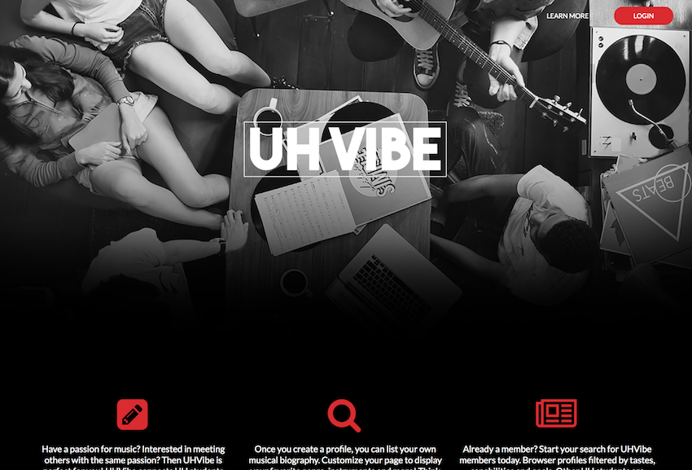
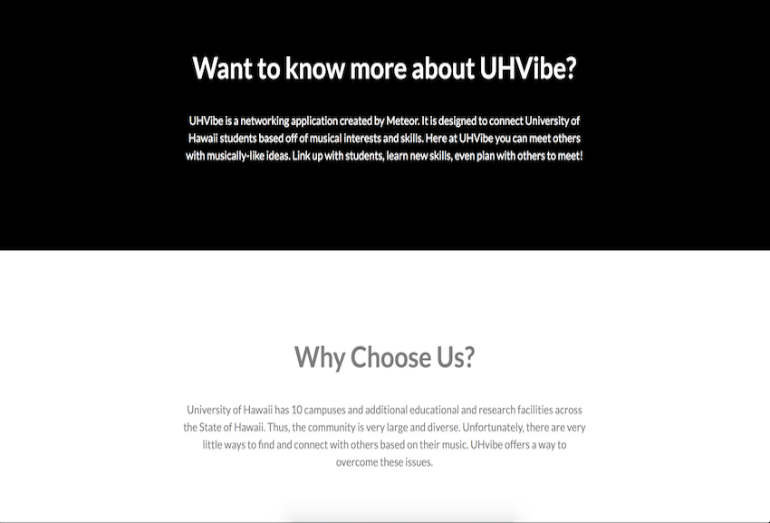
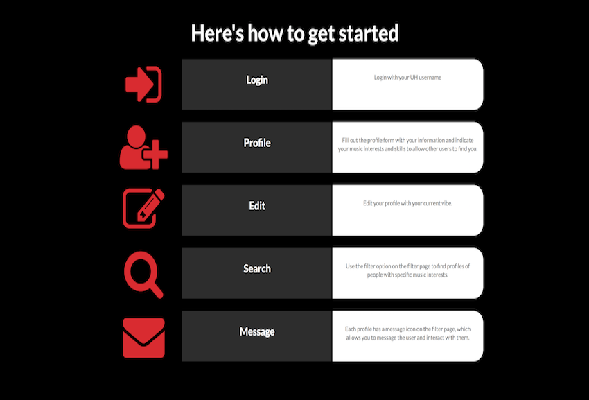
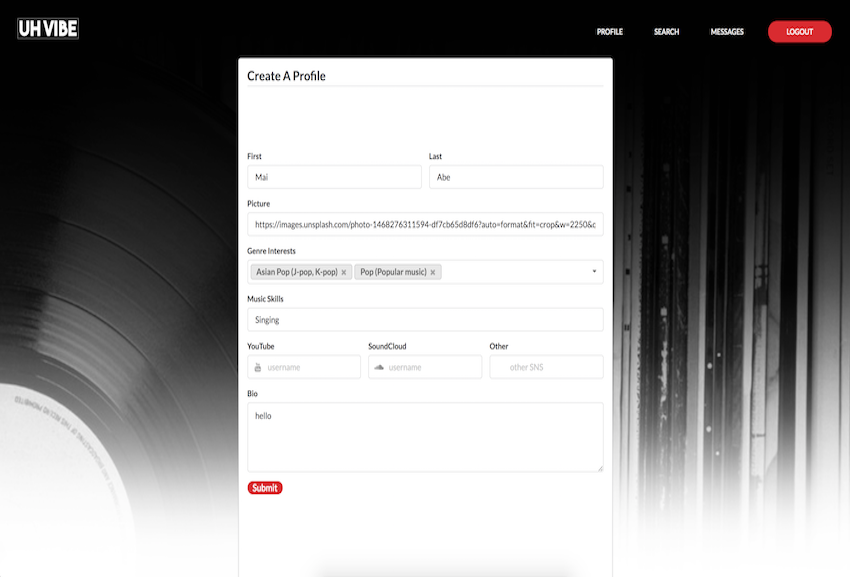
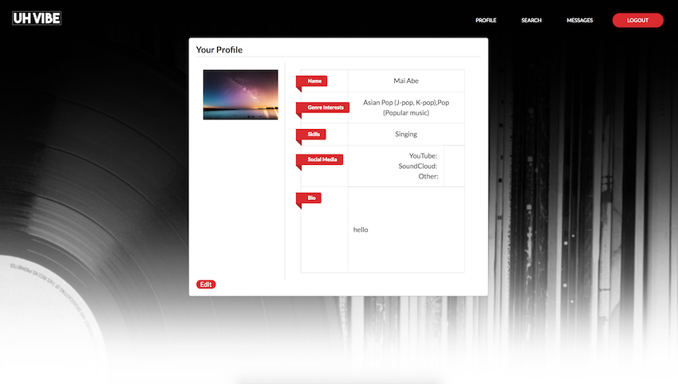
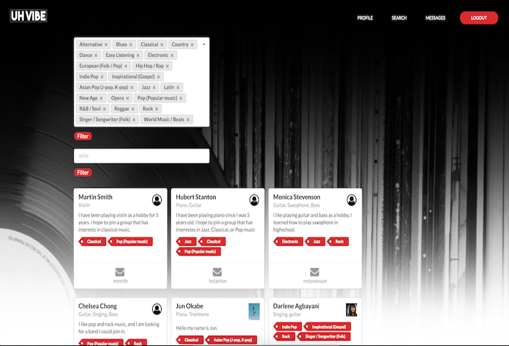
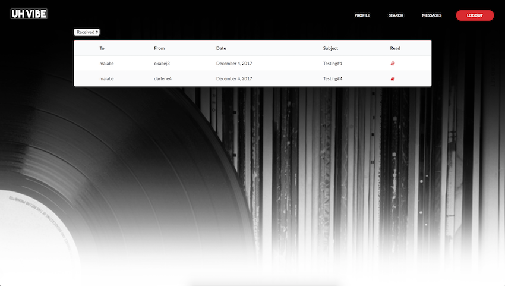

  

  
   
 
  
 

<h1>Description</h1>

UH VIBE is a web application developed for a group project assigned in ICS314 Software Engineering I class. The app was developed using basic HTML and CSS, Javascript Meteor framework, Semantic UI framework, and IntelliJ Idea.
UH VIBE is a web application for University of Hawaii students who are interested in music. The app allows any UH system users to look for a group of people to gather with based on their music interests. The app requires users to log in, create a profile with information about thier music interests, and search for other people in the system who have UH VIBE profiles. The app has a messaging system where users can contact each other to get together. The application is useful for users who are looking to create a band, do a session, talk about music, or even just to make new frieds. 

As seen above, the steps are very simple. First, a user logs in using their UH account. The user will then create a profile, search for other users with similar music interests, and contact the person you want to get in touch with.

<h1>Learning Outcomes to Overcome Challenges</h1>

My role in this group project was to :
 	- Create a site Mockup
 	- Edit profile input subjects
 	- Implement 'Your_Profile' and 'Edit_Profile' page
 	- Implement 'Search Page' functionalities to filter search

This project for me was the first time to develop an app as a group. One of the most challenging part was to fix bugs. There was a bug every time I added some functionalities. I learned how hard it is and time consuming it is to find what I have done wrong. I learned it is important not to make assumptions about anything you write. It was tempting to skip reviewing the code where I thought there was no problem, but there were times those were the parts I have made mistakes on. Every small feature I added to the project was a hustle.

Another struggle I had during this project was to utilize Github efficiently. In the beginning, each group member was editing the code simultaneously, which created problems because there were times that two people were working on the same part at the same time. The main reason for the problem was the lack in communication amongst team members. This set us back to get things done at that moment, but we became better at managing tasks on GitHub as the project progressed. We also became better at communicating with each other using application such as Slack.

<a href="http://uhvibe.meteorapp.com/">Visit UHvibe Here</a>
