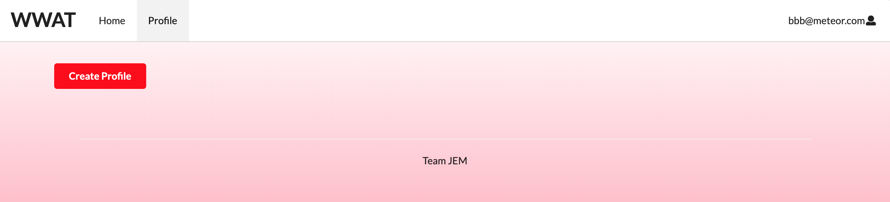

  

  
   

<h1>Description</h1>

WWAT is a web application to control the Yeelight bulb, which is a smart light bulb that allows developers to use a 3rd-party control protocol to develop their own applications and programs to discover and control the bulb. 
WWAT was developed for a group project assigned in ICS414 Software Engineering II Class. 
The app was developed using basic HTML and CSS, Javascript Meteor framework, Semantic UI, React library, and IntelliJ Idea. 
The purpose of the project was to create an ambient interface.
WWAT is short for Women's Wellness Assurance Tracker. 
It is a period tracker web application for women.
The app allows users to create an account, input data about period, ovulation, and PMS cycles, and shows users the prediction for the next period, ovulation, and PMS days. 
The Yeelight connected to WWAT changes its color temperature to notify the user on the day of prediction for period, ovulation, or PMS.

First, a user logs in or signs up with an email address and a password. The Yeelight bulb turns on as the user logs in or signs in. 

The user will then create a profile and enter the related data such as typical period cycle and period duration and PMS duration.

In the user home page, the user can then view the predicted period, ovulation, and PMS days for the next 12 months in the calendar. 

When the current date falls on the period prediction date, fertility prediction date, or the PMS prediction date, the light temperature of the Yeelight bulb will change. 

 

<h1>Learning Outcomes</h1>

My role in this group project was to : 
	<li> Create a web page mock-up for the app </li>
	<li> Implement the Yeelight to connect to the app </li>
	<li> Implement 'Landing', 'Sign-In', and 'Sign-out' pages </li>
	<li> Implement 'User Home' page that includes a calendar that shows the predictions </li>

The hardest part in this project was to implement a calendar that shows predictions in the User Home page. 
We struggled to look for a good library to include for the User Home page. 
It took a lot of time to look for the suitable library we needed in order to show the predictions for period, fertility, and PMS. 
We needed a calendar library that would allow us to insert events on the calendar, present the events in different colors to show differences in each prediction, and insert a full-sized calendar instead of a date-picker.
We ended up using the react-calendar provided by npm, which fulfilld all of our needs for this project. 
There were still restirctions for the react-calendar but once it was intalled, the API was straight forward and allowed us to accomplish the the purpose of the application. 
Another hard part of this project was to learn how to use the React library. 
This was the first time I developed an app using React, but through this project I learned the basic structure of how to utilize components in different pages. 

