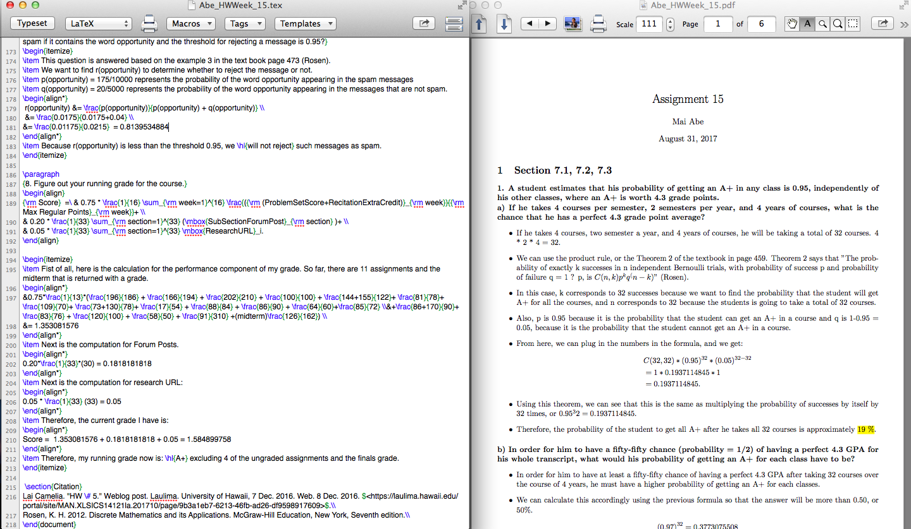

  

 
  
<h1>Description</h1>
In ICS 141, we were encouraged to use Latex when we turn in homework because Latex allowed us to display mathematical equations easily on the document. Although the professor did not require us to use Latex, I tried to write my homework assignments using Latex, hoping to learn new skills to write mathematical equations more neatly on the screen. In one of the discussion questions that everybody in class posts online, there was a question about how to read summation notations. To respond to the question, I created a document explaining how to read summation notation using Latex. 

<h1>Learning Outcomes</h1>
Through this mini project, I learned how to display mathematical equations such as summation notation, how to create titles and body, customize margins, highlighting words, etc. Through making more documents, I also learned how to draw tables, displaying mathematical symbols like logarithms, square root, conditional statements, etc. 

Here is one of the documents I created using Latex, explaining about how to read summation notation. 

