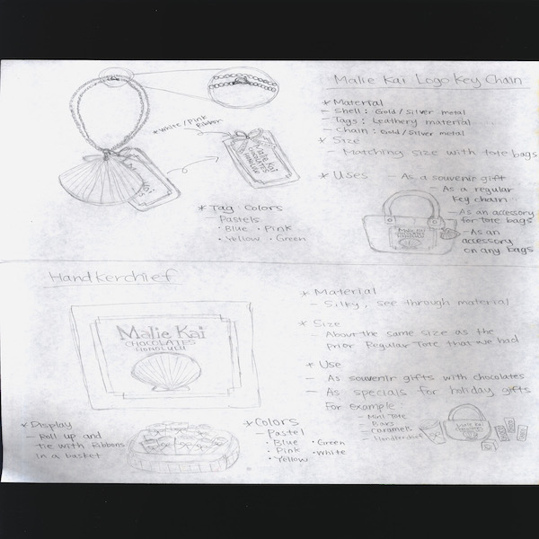

  

When I was working at Malie Kai Chocolates as a sales associate position, there was a small competition amongst 4-5 people to produce ideas about new products for the company. Malie Kai Chocolates is a local company that promotes and sells locally-made cacao chocolates. They also offer logo items on the side such as tote bags and purses. In the competition, the workers were asked to submit ideas for a possible new logo item that promotes the brand. I was able to come in first place for the competition, and got awarded for it.

At work, my job normally was to share my knowledge about our products that are ready to sell. However for this competition, I had to view things differently and think about how a new product will be able to sell. One of the hardest things to think about was the cost of the product. Although we did not have to calculate exactly what the cost is going to be, I had to think about possibilities of what and how much of the materials to use, and what image or words to print on the product. Depending on the size of the product, I had to think about how much of the space the products will take to store at the shop, since the space in the shop is limited. Some other important things to question was how I can make the products represent a good image about the company. And most importantly, I had to think of a product that would sell. It took some time and effort to come up with ideas that meet all the criteria and to draw out my ideas to make them presentable. However, being mentioned that I was the winner of the competition was worth the effort and the time. 

