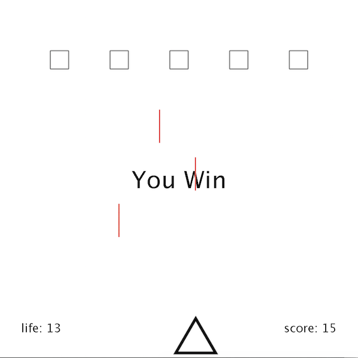

  

  
   

<h1>Description</h1>

My final project for ICS 111 class was the first group programming project that I have ever participated into. We used Java and Eclipse as our IDE. Our final project was to create anything using the skills we have learned over the semester.  My group created a simple shooting game, where the squares on the screen shoot downwards and the triangle which is the player-controlled object shoots back at the squares. When all of the squares are shot by the triangle, the player can proceed to the next level. We created three levels, where bullet speed that the enemies shoot at the triangle increases as the level goes up. The player has 20 lives, and can earn 1 point each time the player hits the enemy with its bullets. 

For the project, we planned out what everybody’s role is going to be to complete the project, but it became harder when one of our group members left the team. Despite an unexpected work load, my group was able to complete the project. 
My role in this project was to :
   - Create enemies (square objects) that shoot bullets at a set speed
   - Making enemies disappear when they get shot
   - Randomize bullet speeds accordingly
   - Making levels of difficulty
   - Adding sound effects

<h1>Learning Outcomes</h1>

Through this project, the most important thing I learned was how to work as a group. Combining somebody else’s code mine was a harder task than I thought, because everybody writes code differently and you have to understand their code. The hardest part in the project was to find out the bug in the code when I combined the code with my group member's code. I reviewed the code many times to figure out what was wrong with it, and spent a lot of time trying to figure out the bug. Once I found out that one of the parts in the code was in the wrong scope and finally fixed the bug, I was very happy and excited. Even though we spent a lot of time and struggled a lot, I felt like I was able to enjoy the feeling of accomplishment that we were able to deliver the project. 

In this project, I learned the basic Java programming skills such as :
  <li> Using for loop</li>
  <li> Making classes to create objects </li>
  <li> Scoping the code in the correct places </li>
  <li> Adding images and sound effects </li>
  <li> Making objects user-controllable </li>

